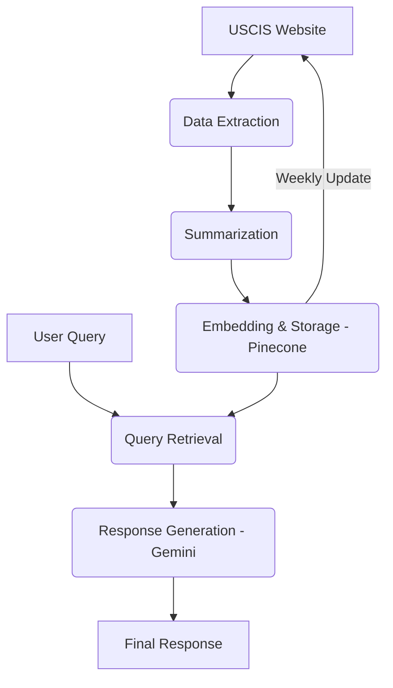

# RAG – Retrieval-Augmented Generation for U.S. Immigration Information

This project implements a **Retrieval-Augmented Generation (RAG)** system that provides intelligent and data-backed answers about **U.S. immigration and international law**. It leverages official, reliable data sourced directly from the **USCIS (U.S. Citizenship and Immigration Services) website**.

The system is designed to automatically crawl, summarize, embed, and retrieve relevant information to generate high-quality responses using the Gemini language model.

---

## 🚀 Overview

The RAG pipeline automates the process of turning complex legal documents into easily queryable information.

### Key Features:

* **Data Extraction:** Automatically crawls and extracts immigration-related information from **USCIS.gov**.
* **Intelligent Summarization:** Summarizes the extracted content to retain key legal and regulatory points.
* **Efficient Vectorization:** Embeds summarized data using **`gemini-embedding-001`** and stores the vectors in **Pinecone** for efficient semantic retrieval.
* **Response Generation:** Answers user queries about immigration or international law from the command line using the **Gemini** model.

### Architecture

The system follows a clear, two-part pipeline: Data Preparation and Query Execution.

